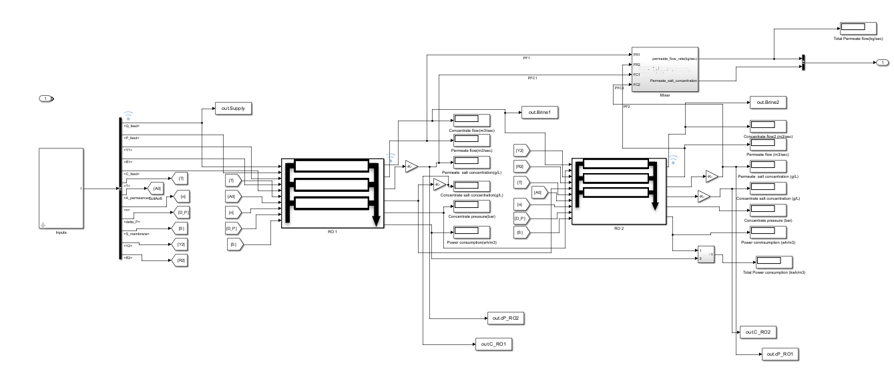

# Water Management and the energy transition

*We seek to stimulate a fast and sustainable energy transition while recognizing the critical value of water throughout the entire green hydrogen value chain.*

## Intro
Green hydrogen plays a key role in the defosillization of base chemicals and industrial production [1]. Despite the global potential for green hydrogen, affordable production using wind or solar energy is limited, mostly to regions the global south [2]. Unfortunately, clean water, as main resource for green hydrogen, is finite and often scarce in these regions [3]. To address these challenges, the use of multiple water source must be considered. The entire process chain from hydrogen to follow-up derivates is referred to as Power-to-X (PtX). The German research project [H2Mare](https://www.wasserstoff-leitprojekte.de/leitprojekte/h2mare) has the goal to cover the entire PtX value chain, with an additional focus on water as the primary resource for green hydrogen. The project addresses technical aspects of offshore hydrogen and PtX production, as well as knowledge transfer and upscaling.

## Objective
Reverse osmosis desalination membranes play a pivotal role in the energy transition, particularly in the context of hydrogen production using seawater. These membranes enable the efficient removal of salt and impurities from seawater, providing a clean source of freshwater for various industrial processes, including green hydrogen production. By utilizing seawater as a feedstock, we can harness the power of renewable energy sources to drive the desalination process, ultimately contributing to a sustainable and water-efficient path for the production of green hydrogen, a key component in the clean energy transition.

## Goal
The interdependence of the management of water and energy is noted to date but not specifically addressed. While fresh water resources worldwide are already being overexploited, the global (green) energy transition will place additional stress on their recharge ability due to an increased application of PtX technologies. By deriving open-access models for various applications of the green hydrogen value chain, we aim to secure a fast but water-smart and sustainable energy transition.

DECHEMA has bundled various aspects of the energy transition with regard to water management in the [Water-for-X](https://dechema.de/Water_for_X.html) roadmap.

# Reverse-Osmosis-Model
Matlab based Model for RO [4]

# Source
[1] Geres, R., Kohn, A., Lenz, S. C., Ausfelder, F., Bazzanella, A., Möller, A., (2019). Future Camp Climate GmbH, DECHEMA, Roadmap Chemie 2050 auf dem Weg zu einer treibhausgasneutralen chemischen Industrie in Deutschland, ISBN: 978-3-89746-223-6

[2] The Future of Hydrogen, IEA, Technology report 2019

[3] Water Risk Institute (WRI), Aqueduct (2019). Overall water risk

[4] Mohammed und Massour El Aoud, „Modeling of Reverse Osmosis Process at a Brackish Water Desalination Station“. https://ieeexplore.ieee.org/document/9442632/ 